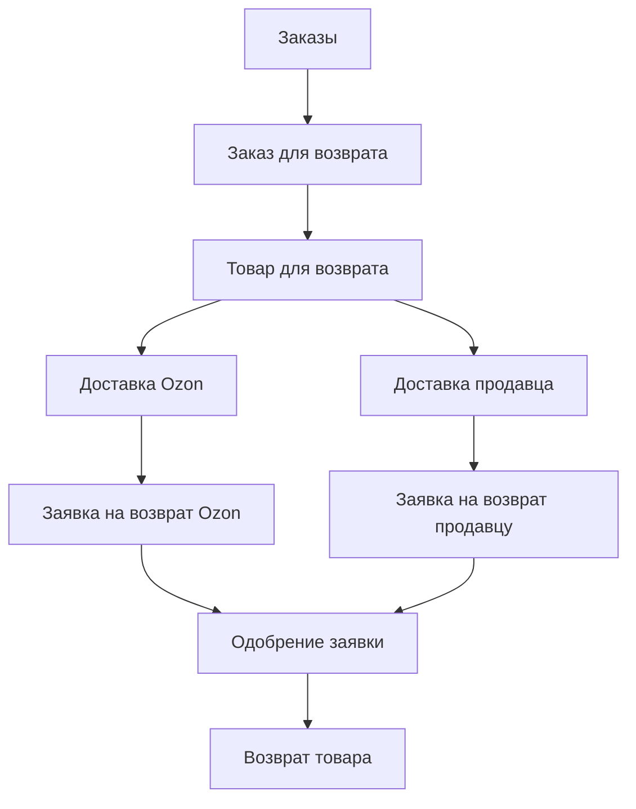

# Системность мышления
Источник: [Как вернуть товар](https://docs.ozon.ru/common/otmena-i-vozvrat-zakaza/kak-vernut-tovar/?country=RU). 
## Схема взаимодействия компонентов

```mermaid
flowchart TD
A[Заказы] --> B[Заказ для возврата]
B[Заказ для возврата] --> C[Товар для возврата]
C[Товар для возврата] --> D[Доставка Ozon]
C[Товар для возврата] --> E[Доставка продавца]
D[Доставка Ozon] --> F[Заявка на возврат Ozon]
E[Доставка продавца] --> G[Заявка на возврат продавцу]
F[Заявка на возврат Ozon] --> I[Одобрение заявки]
G[Заявка на возврат продавцу] --> I[Одобрение заявки]
I[Одобрение заявки] --> J[Возврат товара]
```

