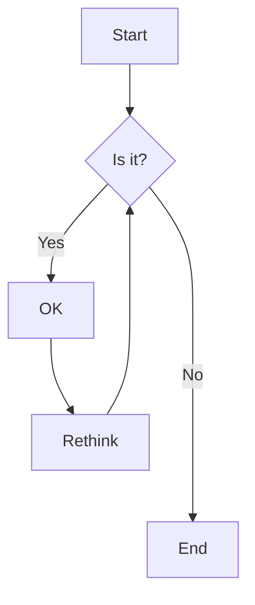

Here is a simple flow chart:



# Системность мышления 
[Как вернуть товар](https://docs.ozon.ru/common/otmena-i-vozvrat-zakaza/kak-vernut-tovar/?country=RU). 
## Схема взаимодействия компонентов

```mermaid
flowchart TD
A[Заказы] --> B[Выбор заказа для возврата]
Выбор заказа для возврата --> Выбор товаров для возврата
Выбор товаров для возврата --> Доставка Ozon
Выбор товаров для возврата --> Доставка продавца
Доставка Ozon --> Выбор способа возврата (Ozon)
Доставка продавца --> Выбор способа возврата
Выбор способа возврата (Ozon) --> Заявка одобрена
Выбор способа возврата --> Заявка одобрена
Заявка одобрена --> Передача товара
```
